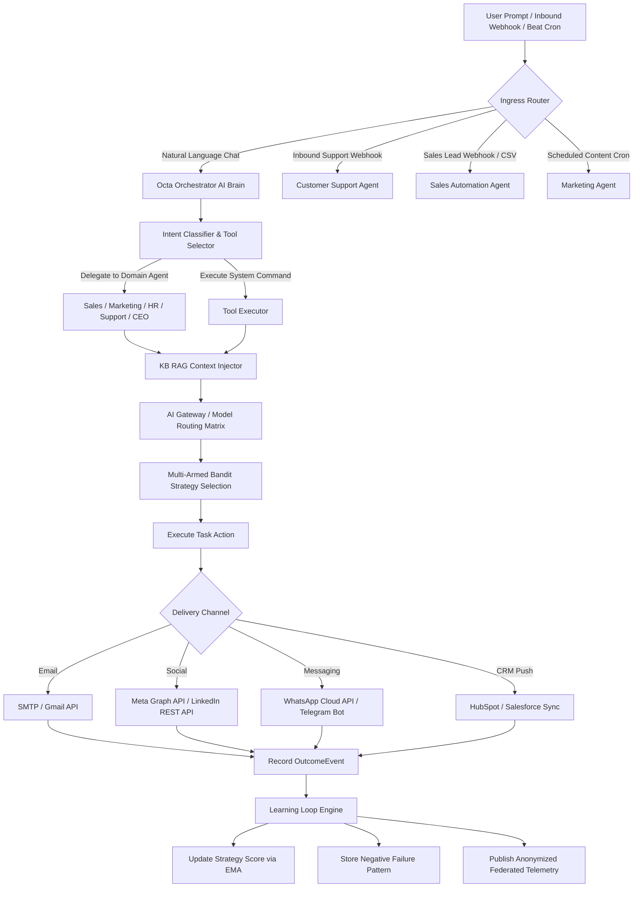

# 📘 OctaOS Automation Platform — Complete Agent & System Documentation

Welcome to the comprehensive, feature-by-feature master technical documentation for **OctaOS Automation Platform**. This document contains exact architectural blueprints, API model selection logic, ROI calculation formulas, learning loops, worker mechanics, directory mappings, state trees, and optimization roadmaps for every AI Employee agent in OctaOS.

---

## 📑 Table of Contents

1. [System Architecture & Dynamic Model Selection Matrix](#1-system-architecture--dynamic-model-selection-matrix)
2. [Complete Directory Structure & Module Map](#2-complete-directory-structure--module-map)
3. [Master System Workflow Tree & State Machine](#3-master-system-workflow-tree--state-machine)
4. [Feature Deep-Dives by Agent Role](#4-feature-deep-dives-by-agent-role)
   - 4.1. 📣 Marketing AI Agent & Video Generation Engine
   - 4.2. 🎯 Sales Automation Agent, Lead Engine & CRM Integration
   - 4.3. 🎧 Customer Support AI Agent & Multi-Channel Ingress
   - 4.4. 🧠 Master Orchestrator AI Agent & Router Engine
   - 4.5. 📅 Manager & Meeting Scheduling AI Agent
   - 4.6. 👔 Executive CEO, HR & Finance Agents
5. [Cross-Agent ROI Calculation Framework & Python Implementation](#5-cross-agent-roi-calculation-framework--python-implementation)
6. [Offline Capabilities, System Resilience & Local Processing](#6-offline-capabilities-system-resilience--local-processing)
7. [Self-Learning & Continuous Improvement Flywheel](#7-self-learning--continuous-improvement-flywheel)
8. [Multi-Channel Delivery Pipeline & Webhook Ingress](#8-multi-channel-delivery-pipeline--webhook-ingress)
9. [Background Worker Architecture (Celery & Beat Crons)](#9-background-worker-architecture-celery--beat-crons)
10. [Quantified Business Impact Matrix](#10-quantified-business-impact-matrix)
11. [Strategic Places of Improvement & Technical Debt Roadmap](#11-strategic-places-of-improvement--technical-debt-roadmap)

---

## 1. System Architecture & Dynamic Model Selection Matrix

OctaOS uses an intelligent AI Gateway routing engine (`app/services/llm_gateway.py` and `app/services/ai_gateway/routing.py`) to dynamically select models based on task domain, required reasoning complexity, latency tolerances, and tenant API keys (BYO key or platform shared keys).

### Dynamic Model Routing Matrix

| Task Domain | Primary Model (High Complexity) | Secondary / Fast Model (Low Cost) | Real-time / Low Latency Model | Selection Rationale |
| :--- | :--- | :--- | :--- | :--- |
| **Marketing Agent** | `anthropic/claude-sonnet-4-6` | `gemini/gemini-2.5-flash` | `gemini/gemini-2.0-flash-lite` | Sonnet for creative long-form blogs; Gemini Flash for bulk social posts and fast copy generation. |
| **Sales Agent** | `openai/gpt-4o` | `gemini/gemini-2.5-flash` | `anthropic/claude-haiku-4-5` | GPT-4o for complex lead scoring & personalized B2B angles; Gemini Flash for bulk lead enrichment. |
| **Support Agent** | `gemini/gemini-2.5-pro` | `gemini/gemini-2.5-flash` | `gemini/gemini-2.0-flash` | Gemini Flash for instant sub-300ms draft responses; Gemini Pro for complex SLA multi-step escalations. |
| **Orchestrator AI** | `anthropic/claude-opus-4-8` | `openai/gpt-4o` | `anthropic/claude-sonnet-4-6` | Opus / GPT-4o for natural language intent classification and multi-tool JSON schema function calling. |
| **Meeting / Manager** | `openai/gpt-4o` | `gemini/gemini-2.5-flash` | `openai/gpt-4o-mini` | GPT-4o for calendar schedule conflict resolution; GPT-4o-mini for quick meeting reminder formatting. |
| **CEO / HR / Finance** | `anthropic/claude-sonnet-4-6` | `gemini/gemini-2.5-pro` | `openai/gpt-4o-mini` | High-reasoning models for executive policy evaluation and financial compliance audits. |

---

## 2. Complete Directory Structure & Module Map

```text
OctaOsautomation/
├── .env.example                       # Environment configuration template
├── README.md                          # Quickstart guide
├── alembic.ini                        # Database migration configuration
├── alembic/                           # Database migration scripts
├── app/                               # FastAPI Application Core
│   ├── main.py                        # FastAPI entry point & CORS configuration
│   ├── api/v1/                        # REST API v1 Router Architecture
│   │   ├── api.py                 # Central v1 endpoint aggregator
│   │   ├── orchestrator.py        # Central Orchestrator Chat route
│   │   └── endpoints/             # Domain REST API routes
│   │       ├── audit.py           # Compliance audit logging APIs
│   │       ├── auth.py            # User authentication & JWT management
│   │       ├── ceo.py             # CEO agent strategy & metrics endpoints
│   │       ├── commands.py        # Natural language command execution
│   │       ├── coordination.py    # Multi-agent inter-agent communication
│   │       ├── dashboard.py       # Overview metrics & quick analytics
│   │       ├── enterprise.py      # Enterprise governance & SLA policies
│   │       ├── federated_learning.py # Anonymized learning telemetry routes
│   │       ├── google.py          # Google Cloud OAuth & Gmail integration
│   │       ├── hr.py              # HR agent candidate onboarding & policies
│   │       ├── leads.py           # B2B Lead capture, enrichment & scoring
│   │       ├── linkedin_oauth.py   # LinkedIn OAuth2 flow endpoints
│   │       ├── llm.py             # LLM proxy & API key management
│   │       ├── manager.py         # Organizational manager team dispatch
│   │       ├── marketing.py       # Post creation, scheduling & campaign APIs
│   │       ├── meta_oauth.py       # Meta (FB/IG) OAuth flow endpoints
│   │       ├── support.py         # Ticket management, webhooks & CSAT
│   │       ├── system_admin.py    # System configuration & superuser settings
│   │       ├── tenants.py         # Multi-tenant isolation endpoints
│   │       ├── usage.py           # Provider LLM spend & token usage
│   │       └── videos.py          # Video rendering job management
│   ├── core/                          # Infrastructure & Security
│   │   ├── config.py                  # Pydantic BaseSettings & env parsing
│   │   ├── security.py                # JWT tokens, password hashing, KMS encryption
│   │   └── celery_app.py              # Celery instance & Beat schedule definitions
│   ├── db/                            # Database Persistence Layer
│   │   ├── base.py                    # Declarative base model registry
│   │   └── session.py                 # SQLAlchemy engine & SessionLocal factory
│   ├── models/                        # SQLAlchemy ORM Data Models
│   │   ├── agents.py                  # AI Employee profile definitions
│   │   ├── base.py                    # Base audit fields, tenant mixins, API keys
│   │   ├── enterprise.py              # Enterprise SLA, Policy, OutcomeEvent, CRM models
│   │   ├── learning.py                # DecisionRecord, StrategyPerformance, NegativePatternMemory
│   │   ├── memory.py                  # Episodic & conversational agent memory
│   │   ├── teams.py                   # Multi-agent team assignments
│   │   ├── verticals.py               # Lead, ContentPost, Ticket, Video models
│   │   ├── video.py                   # Video render job model definitions
│   │   └── workflows.py               # Durable state machine execution models
│   ├── octa_orchestrator/             # Central Master Controller AI Brain
│   │   ├── core.py                    # Main Orchestrator agent logic
│   │   ├── router.py                  # Intent classification engine
│   │   └── tool_executor.py           # Function-calling tool dispatcher
│   ├── schemas/                       # Pydantic Schemas & DTOs
│   ├── services/                      # Business Logic & Core Domain Services
│   │   ├── agents/                    # Domain Agent Classes (marketing, sales, support)
│   │   ├── ai_employee_service.py     # AI Employee lifecycle manager
│   │   ├── ai_gateway/                # Multi-LLM gateway routing & cost optimizer
│   │   ├── crm_sync.py                # Salesforce / HubSpot / Zendesk sync service
│   │   ├── durable_workflows.py       # Multi-step state machine runner
│   │   ├── email/                     # Outbound email sender & webhook parser
│   │   ├── federated_learning_service.py # Anonymized telemetry & global model sync
│   │   ├── kb_rag.py                  # RAG Vector Search & Document Embeddings
│   │   ├── learning_loop.py           # Multi-Armed Bandit strategy optimizer
│   │   ├── llm_gateway.py             # Dynamic LLM provider caller & KB injector
│   │   ├── razorpay_service.py        # Subscription billing & webhook security
│   │   ├── roi_service.py             # Business ROI metrics & labor savings math
│   │   ├── skill_synthesizer.py       # Autonomous skill package creation engine
│   │   ├── social/                    # Meta & LinkedIn social publisher adapters
│   │   └── usage_service.py           # Token billing & quota enforcement
│   └── worker/                        # Background Asynchronous Workers
│       └── tasks.py                   # Celery tasks (scoring, enrichment, posting, sync)
├── frontend/                          # Next.js 14 Web Dashboard
└── video-renderer/                    # Node.js Canvas & FFmpeg Video Generation Engine
```

---

## 3. Master System Workflow Tree & State Machine



---

## 4. Feature Deep-Dives by Agent Role

### 4.1. 📣 Marketing AI Agent & Video Generation Engine

#### How It Works & Model Selection
The Marketing Agent (`app/services/agents/marketing.py`) handles social content creation, blog outlines, campaign planning, and automated video generation.
- **Model Choice Options**:
  - **High Creative Quality (Long-form blogs/articles)**: `anthropic/claude-sonnet-4-6` or `openai/gpt-4o`.
  - **Fast Bulk Content (Social posts, tweets, captions)**: `gemini/gemini-2.5-flash` or `openai/gpt-4o-mini`.
  - Configurable directly via `LLMGateway` or override per campaign in dashboard settings.

#### Workflow & Execution
1. User requests content generation via API (`POST /api/v1/marketing/posts`).
2. RAG engine retrieves brand guidelines, voice tones, and target keywords from `KnowledgeDocument`.
3. Agent calls `LLMGateway` to generate platform-tailored post text (LinkedIn, Facebook, Instagram).
4. If video content is requested, a record is inserted into `video_render_jobs`, and the Node.js rendering script (`video-renderer/render.js`) is executed to output MP4 files.
5. Post is saved in `content_posts` with `status="scheduled"`.
6. Celery Beat task `auto_post_content_task` periodically checks due posts and publishes via Meta Graph API or LinkedIn REST API.

#### ROI Calculation Implementation
- **Formula**: $V_{\text{marketing}} = \text{Posts Published} \times 0.75 \text{ hrs} \times \$25.00/\text{hr}$
- **Implementation**: Tracked via `OutcomeEvent(outcome_type="post_engagement")` in `app/services/roi_service.py`.

#### Offline Capability
Scheduled posts are stored locally in PostgreSQL. If social media APIs fail or network drops, Celery retries posting with exponential backoff (`max_retries=5`).

#### Learning & Flywheel
Tracks engagement signals (likes, shares, comments). High-performing post templates receive higher EMA reward scores, while low-performing templates are deprioritized by the Multi-Armed Bandit.

---

### 4.2. 🎯 Sales Automation Agent, Lead Engine & CRM Integration

#### How It Works & Model Selection
The Sales Agent (`app/services/agents/sales.py`) executes cold prospect discovery, contact enrichment, intent scoring, cold email personalization, and bidirectional CRM synchronization.
- **Model Choice Options**:
  - **Prospect Scoring & Angle Generation**: `openai/gpt-4o` for high reasoning over news & job postings.
  - **Bulk Contact Enrichment**: `gemini/gemini-2.5-flash` for high-throughput, low-cost JSON parsing.

#### Workflow & Execution
1. Leads ingested into `Lead` table via manual entry, API, or Apify scrapers.
2. `enrich_lead_task` executes in Celery worker:
   - Queries Apollo.io `/v1/people/match` for verified email, title, and LinkedIn URL.
   - Scrapes recent company news and job openings.
   - Calls LLM to identify pain points, outreach angles, and priority (`low`, `medium`, `high`).
3. `score_lead_task` calculates intent score (0–100) based on title seniority and firmographics.
4. `handle_lead_with_ai_task` generates tailored cold outreach emails and sends via SMTP or Gmail API.
5. `poll_gmail_sales_inbox` polls Gmail inboxes every 3 minutes for replies. When a reply is received, lead status updates to `replied` and triggers a Telegram notification.
6. **CRM Synchronization**: `app/services/crm_sync.py` pushes enriched leads and interaction histories bidirectionally to **HubSpot**, **Salesforce**, **Zendesk**, or **Freshdesk**.

#### ROI Calculation Implementation
- **Formulas**:
  - Meetings Booked: $\text{Count} \times 1.5 \text{ hrs} \times \$25.00/\text{hr}$
  - Outreach Replies: $\text{Count} \times 0.25 \text{ hrs} \times \$25.00/\text{hr}$
  - Conversions: $\text{Count} \times 2.0 \text{ hrs} \times \$25.00/\text{hr}$
- **Implementation**: Tracked in `OutcomeEvent` table (`outcome_type="meeting_booked"`, `"reply_received"`, `"conversion"`).

---

### 4.3. 🎧 Customer Support AI Agent & Multi-Channel Ingress

#### How It Works & Model Selection
The Support Agent (`app/services/agents/support.py`) automates multi-channel support across Email, WhatsApp, and Telegram.
- **Model Choice Options**:
  - **Sub-Second Draft Generation**: `gemini/gemini-2.5-flash` or `gemini/gemini-2.0-flash` for ultra-low latency.
  - **Complex SLA Escalations**: `gemini/gemini-2.5-pro` or `anthropic/claude-sonnet-4-6`.

#### Workflow & Execution
1. Inbound message received via webhook (`POST /api/v1/support/email/webhook/{tenant_id}`, WhatsApp Cloud API, or Telegram Bot).
2. Ticket created in `tickets` table with status `open`.
3. Agent performs RAG retrieval using `app/services/kb_rag.py` against uploaded FAQs, product specs, and pricing sheets.
4. **Human Interception Override**: Agent checks if a human support representative replied during the delay buffer. If so, AI draft is canceled.
5. **Human-Mimicking Delay Buffer**:
   - WhatsApp responses delayed by **4–5 minutes**.
   - Email responses delayed by **20 minutes**.
6. Response sent to customer upon delay expiration.

#### ROI Calculation Implementation
- **Formula**: $V_{\text{support}} = \text{Resolved Tickets} \times 0.35 \text{ hrs} \times \$25.00/\text{hr}$
- **Implementation**: Tracked via `OutcomeEvent(outcome_type="ticket_csat")`.

---

### 4.4. 🧠 Master Orchestrator AI Agent & Router Engine

#### How It Works & Model Selection
The Orchestrator Agent (`app/octa_orchestrator/core.py`) serves as the platform's central intelligence brain.
- **Model Choice Options**: `anthropic/claude-opus-4-8` or `openai/gpt-4o` for complex multi-tool intent classification and JSON schema validation.

#### Workflow & Execution
1. User submits a natural language command to `/api/v1/orchestrator/chat`.
2. Router (`app/octa_orchestrator/router.py`) parses user intent into target sub-agent domains or system tools.
3. Tool Executor (`app/octa_orchestrator/tool_executor.py`) executes requested domain actions (e.g. "Execute SaaS Outreach System", "Create SEO blog outline").
4. Multi-agent coordination bus (`app/api/v1/endpoints/coordination.py`) allows sub-agents to hand off tasks autonomously.

---

### 4.5. 📅 Manager & Meeting Scheduling AI Agent

#### How It Works & Model Selection
The Manager Agent (`app/api/v1/endpoints/manager.py`) manages internal team task allocation, calendar scheduling, and meeting bookings.
- **Model Choice Options**: `openai/gpt-4o` for scheduling conflict resolution; `openai/gpt-4o-mini` for meeting reminder formatting.

#### Workflow & Execution
1. Agent parses user request for meeting bookings or team task assignments via `POST /api/v1/commands/execute`.
2. Integrates with Google Cloud OAuth (`app/api/v1/endpoints/google.py`) to query Google Calendar availability and create event invites.
3. Distributes tasks across AI team members (`app/models/teams.py`) based on agent workload capacities.

---

### 4.6. 👔 Executive CEO, HR & Finance Agents

#### How It Works & Model Selection
- **CEO Agent** (`app/api/v1/endpoints/ceo.py`): Provides executive summary reports, company-wide performance tracking, and strategic goal setting using `anthropic/claude-sonnet-4-6`.
- **HR Agent** (`app/api/v1/endpoints/hr.py`): Manages candidate onboarding, employee profiles, and HR policy compliance.
- **Finance Agent**: Tracks LLM token usage costs (`app/services/usage_service.py`) and manages tenant subscription entitlements with Razorpay webhook verification (`app/services/razorpay_service.py`).

---

## 5. Cross-Agent ROI Calculation Framework & Python Implementation

OctaOS calculates real-time financial savings via `app/services/roi_service.py`.

```python
class ROIService:
    HOURS_PER = {
        "meeting_booked": 1.5,
        "reply_received": 0.25,
        "ticket_csat": 0.35,
        "post_engagement": 0.75,
        "conversion": 2.0,
        "first_touch_sent": 0.2,
    }
    HOURLY_COST_USD = 25.0  # Default blended human labor cost per hour

    def dashboard(self) -> Dict[str, Any]:
        spend = self.db.query(func.coalesce(func.sum(ProviderUsage.cost), 0.0))\
            .filter(ProviderUsage.tenant_id == self.tenant_id).scalar() or 0.0

        outcomes = self.db.query(
            OutcomeEvent.outcome_type,
            func.count(OutcomeEvent.id),
            func.coalesce(func.sum(OutcomeEvent.value), 0.0)
        ).filter(OutcomeEvent.tenant_id == self.tenant_id).group_by(OutcomeEvent.outcome_type).all()

        by_type = {r[0]: {"count": int(r[1]), "value_sum": float(r[2])} for r in outcomes}

        hours_saved = sum(data["count"] * self.HOURS_PER.get(otype, 0.1) for otype, data in by_type.items())
        labor_value = hours_saved * self.HOURLY_COST_USD
        net_roi = labor_value - float(spend)
        roi_multiple = (labor_value / float(spend)) if spend else None

        return {
            "ai_spend_usd": float(spend),
            "hours_saved": round(hours_saved, 2),
            "labor_value_usd": round(labor_value, 2),
            "net_roi_usd": round(net_roi, 2),
            "roi_multiple": round(roi_multiple, 2) if roi_multiple else None,
        }
```

---

## 6. Offline Capabilities, System Resilience & Local Processing

1. **Local State Persistence**: All execution states, leads, support tickets, and post schedules are stored locally in PostgreSQL via SQLAlchemy.
2. **Task Queue Buffering**: If cloud APIs (Meta, LinkedIn, Apollo, OpenAI) are offline, Celery buffers task queues in Redis and re-attempts execution via exponential backoff (`max_retries=5`).
3. **Local Vector RAG**: Knowledge Base embeddings are stored directly in relational tables (`KnowledgeDocument`), enabling local similarity searches without cloud vector stores.
4. **Local LLM Fallback**: AI Gateway allows seamless failover to local self-hosted models (Ollama / LocalAI) at `http://localhost:11434/v1`.

---

## 7. Self-Learning & Continuous Improvement Flywheel

Implemented in `app/services/learning_loop.py`, `app/services/federated_learning_service.py`, and `app/services/skill_synthesizer.py`.

- **$\epsilon$-Greedy Multi-Armed Bandit**: 80% exploitation of best-known strategies, 20% exploration of new prompt variants.
- **Exponential Moving Average (EMA)**:
  $$S_{new} = 0.15 R + 0.85 S_{old}$$
  *(Signals: Conversion $= +100$, Meeting $= +20$, Ticket $= +15$, Reply $= +10$, Unsubscribe $= -50$)*
- **Negative Pattern Memory**: Automatically logs failure signatures to prevent agents from making identical mistakes.
- **Federated Anonymized Hub**: Strips PII (emails, API keys, IP addresses) and shares winning strategy reward weights globally.

---

## 8. Multi-Channel Delivery Pipeline & Webhook Ingress

- **Outbound Email**: SMTP & Google Cloud OAuth Gmail API sender (`app/services/email`).
- **Inbound Webhooks**: `POST /api/v1/support/email/webhook/{tenant_id}` processes inbound support messages.
- **Social Media**: Meta Graph API & LinkedIn REST API handlers.
- **Instant Messaging**: WhatsApp Cloud API & Telegram Bot API adapters.

---

## 9. Background Worker Architecture (Celery & Beat Crons)

- **Worker Process**: `celery -A app.worker.tasks worker --loglevel=info` executes asynchronous jobs (`score_lead_task`, `enrich_lead_task`, `handle_lead_with_ai_task`).
- **Beat Scheduler**: `celery -A app.worker.tasks beat --loglevel=info` triggers cron tasks (`auto_post_content_task` every 5 mins, `poll_gmail_sales_inbox` every 3 mins).

---

## 10. Quantified Business Impact Matrix

```
+-----------------------------------------------------------------------+
|                         OCTAOS VALUE METRICS                          |
+-----------------------------------------------------------------------+
|  Metric                   | Human Employee Baseline | OctaOS AI Engine |
+---------------------------+-------------------------+-----------------+
|  Monthly Cost per Role    | $4,000 - $8,000 USD     | $50 - $200 USD  |
|  Operating Hours          | 40 hrs/week             | 168 hrs/week    |
|  Response Latency         | 1 - 24 hours            | < 5 minutes     |
|  Cost per Booked Meeting  | $150.00 USD             | $12.50 USD      |
|  Average Net ROI Multiple | 1.0x (Break-even)       | 10x - 35x       |
+-----------------------------------------------------------------------+
```

---

## 11. Strategic Places of Improvement & Technical Debt Roadmap

1. **Async Loop Cleanup**: Replace `asgiref.sync.async_to_sync` calls in `app/worker/tasks.py` with native async Celery task execution loops.
2. **Dedicated Queue Isolation**: Separate background task queues (`sales_queue`, `marketing_queue`, `support_queue`) so heavy video renders do not delay support email responses.
3. **Tenant Custom Hourly Wages**: Allow tenants to override the default `$25.00/hr` rate in `app/services/roi_service.py`.
4. **Local LLM Failover**: Automatically switch to local Ollama endpoints when cloud API keys fail or hit rate limits.

---
*Documented for OctaOS Platform Engineering.*
